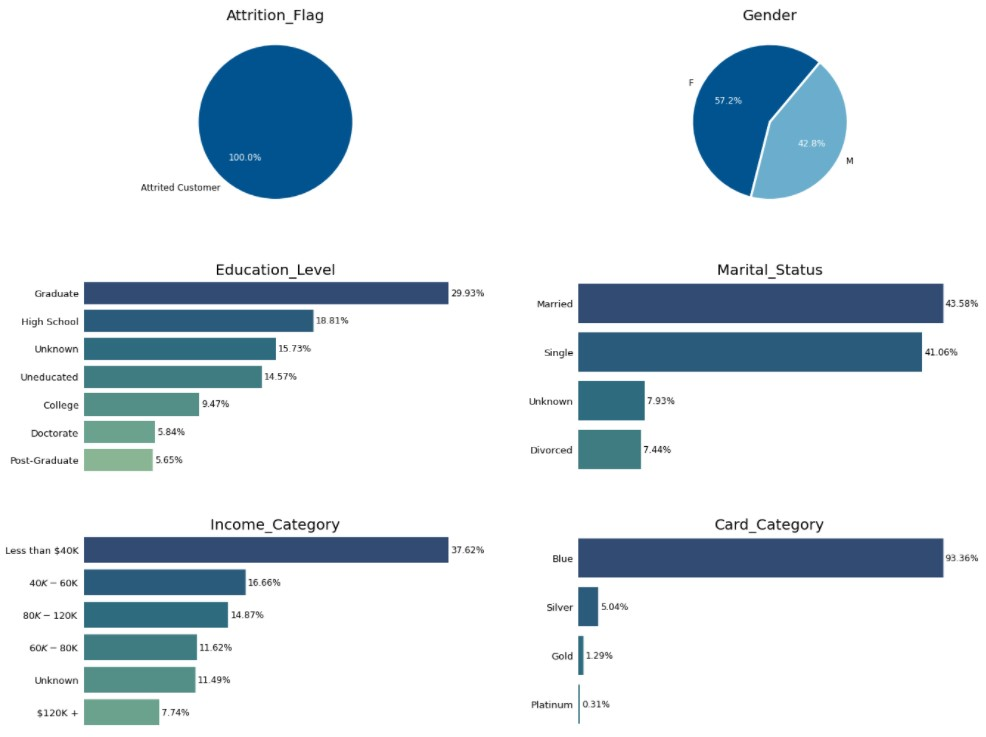
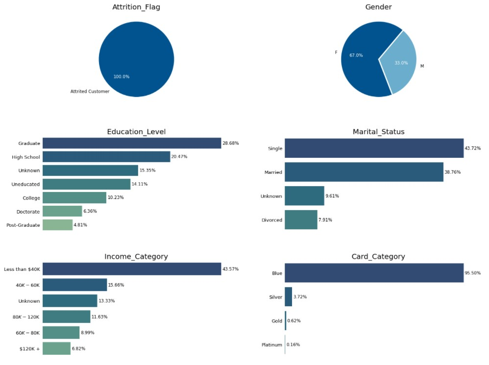

# Data Analysis through Visualization

## _Data Exploration_


The data has around 84 percent samples for existing customers and only 16 percent samples for the attrited customers.

All the codes are mentioned in the jupyter notebook attached.
## Approach
The data will be split in two subsets according to the existing customers and attrited customers. Furthermore, categorical and numerical will be analysed separately to gain insights into the data.

We will try to compare how the subset for attrited customer differs from the existing customers and make predictions accordingly.

## _Analysis of categorical data for existing and attrited customers_


Above is the distribution of categorical values for attrited customers. At first glance, it may look like that there is clear trend in the categories but we should check if the same pattern emerges for existing customers also.



The existing customers shows the almost identical data distribution for the categories, hence the dependency on these categories cannot be determined by this analysis alone.

## _Analysis of numerical data for existing and attrited customers_


Above are the plots for the numerical features to understand the data distribution and data concentration better.

Now we will numerically describe the data for metrics like mean and standard deviation and compare existing and attrited data. (self = existing , other = attrited in the chart below).


Some columns for attrited customers show significant mean deviation from the existing customers data. To validate our findings we will use _autocorrelations_ between attrition_flag and other numerical columns.


After combining the above results the following are the most important features that determine the attrition_flag of the dataset.(_Ranked in descending order of their singificance_)
```sh
columns = ['Total_Trans_Ct', 'Total_Revolving_Bal', 'Total_Ct_Chng_Q4_Q1',  'Contacts_Count_12_mon', 'Avg_Utilization_Ratio', 'Total_Trans_Amt']
```

## Analyzing categorical data again with the above findings

Now we filter and plot the attrited customer data according to the _'Total_Trans_Ct'(highest correlation)_ with values restricted to one standard deviation as it can suggest some pattern in the categorical data.
```sh
data_cor = data[data['Attrition_Flag'] == 'Attrited Customer']
data_cor = data_cor[(data_cor['Total_Trans_Ct']>=30) & (data_cor['Total_Trans_Ct']<= 59)]
```



It can be noticed that the 'Education_level' distribution still doesn't differ much from the original 'Existing Customer' data, however, the gender ratio has changed drastically. The female percent has increased from 52% to 67%, Less than $40K category has increased from 34 to 43%. Moreover, there has been a slight increase in blue card category from 93% to 95.5% respectively.

## Conclusion

It can be seen that the numerical features are of prime importance. To target the potential customers, the selected columns above may be filtered upon by their mean and standard deviation values. Theoretically, customers showing lesser utlization and activity of the cards should be called upon as suggested by lesser values of ['Total_Trans_Ct','Total_Revolving_Bal' 'Total_Ct_Chng_Q4_Q1', 'Avg_Utilization_Ratio', 'Total_Trans_Amt'] features for attrited customers. Moreover, if a customer has contacted the bank quite frequently(_'Contacts_Count_12_mon'_), it maybe a sign of discontent, he/she maybe facing problems and the customer doesn't want a credit card. The focus should be more on the female customers and the customers with income less than $40k and having a blue card.

## Limitations 

The no. of samples for attrited customers are quite less so the properties learned above maybe misleading for general data. The feature analysis is independent, more columns can be grouped and assesed together for better results. A good approach to deep dive into the problem will be to implement Machine-learning models like K-means clustering for an enhanced insight into the feature behaviour.
